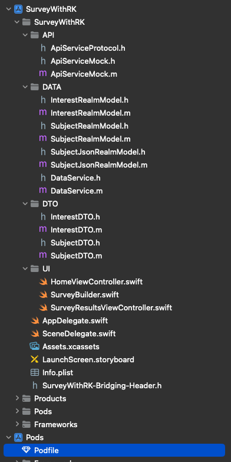

# Survey With ResearchKit TestTask

## Description
This repository contains a test task implementing a survey using **ResearchKit**. The project adheres to the [Task Requirements](Task.md).

## Technologies Used
- **Swift**: 56.1%
- **Objective-C**: 41%
- **Ruby**: 2.9%

## How to Build and Run the Project

The project uses **CocoaPods** as a dependency manager. Ensure it is installed before proceeding. If not, refer to the [CocoaPods Getting Started Guide](https://guides.cocoapods.org/using/getting-started.html) for installation instructions.

### Steps to Build:
1. Open Terminal.
2. Navigate to your desired directory.
3. Clone the repository with:
```bash
git clone https://github.com/userow/SurveyWithRK.git
```
4.	Change directory to the project folder:
```bash
cd SurveyWithRK
```
5. Install dependencies using:
```bash
pod install
```
6. If you encounter issues, run:
```bash
pod repo update
```
and repeat step 5.

### Running the Project:
-	After the dependencies are installed, open the .xcworkspace file and build the project using Xcode.

##  Assumptions Made and Architectural Choices
### Libraries Used
- [ReasearchKit](https://github.com/ReasearchKit/ReasearchKit)
- [Mantle](https://github.com/Mantle/Mantle)
- [Realm](https://github.com/realm/realm-swift)

#### ResearchKit Version

- **ResearchKit version 1.5.2** was used. It is the pre-last stable version prior to the major 2.0.0 release. The most recent version, **2.2.16**, caused crash after pressing **NEXT** during the age entry step in the survey, so version 1.5.2 was chosen to ensure stability.

### Assumptions Made and Architectural Choices

Due to strict time management constraints, the architecture was simplified to follow the **MVC** pattern to speed up development.

#### Project Structure:



Several services were created to ensure code cleanliness and separation of responsibilities.

- The `UI` directory contains UI-related classes, such as:
  - `HomeViewController`
  - `SurveyResultsViewController`
  - The `SurveyBuilder.swift` class, which returns a pre-built ResearchKit `ORKTaskViewController`.

- The `DTO` directory contains **Data Transfer Objects (DTOs)**:
  - `InterestsDTO`
  - `SubjectDTO`
  - Both are subclasses of `MTLModel`, using Mantle for JSON serialization.

- The `DATA` directory contains:
  - **Realm** data classes.
  - The `DataService` class, responsible for retrieving and deserializing saved surveys from JSON strings.

- The `API` directory contains:
  - The API protocol.
  - A mock API implementation (`ApiServiceMock`), which saves survey results from DTOs to Realm.

`ApiServiceMock` is initialized in the `SceneDelegate` and passed to `HomeViewController` via its initializer.

### Potential improvements NOT made:
- Coordinator for navigation and assembling ViewControllers and passing dependencies through it's initilizer
- Strict and testable architecture (MVVM, MVP)
- Intense use of ResearchKit - `SurveyBuilder` were using only basic features.
- Better error handling and user feedback. - In some cases (not involving ResearchKit part - the errors and validations there were made quite well) error handling were represented as it's logging by print(err) / NSLog(err)
- `SurveyResultsViewController` screen state for case of zero saved Surveys.


## Usage
On the home screen, you will find two options:
- Start ResearchKit Survey:  Launches a survey powered by ResearchKit.
- View Saved Survey Results:  Displays previously saved survey results.

## Overall User Experience:
To get a quick overview of the app’s functionality and user experience, [watch the demo video.](DOCS/Demo.mp4)

## Contributing
You could suggest improvements to a project by providing a Pull Requiest or by writing to author of a project.

## License
Creative Commons Attribution NonCommercial Share-Alike (CC BY-NC-SA) except 3d party libraries.

Feel free to add or modify sections as needed for your specific project.
